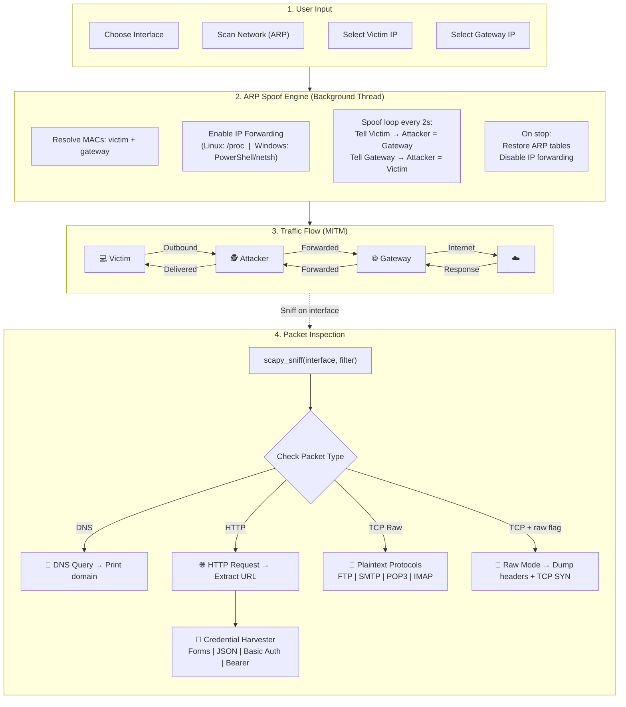

<div align="center">

# 🔭 NetworkSniffer

**A Python-based MITM network sniffer with ARP spoofing, credential harvesting, and live device scanning.**


> ⚠️ **For educational and authorized testing purposes only.** Do not use on networks you do not own or have explicit permission to monitor.

</div>

---

## 📖 Overview

NetworkSniffer is a two-module MITM (Man-in-the-Middle) tool that combines **ARP cache poisoning** with **deep packet inspection** to intercept and analyze network traffic on a LAN.

1. **ARP Spoofer** (`arp_spoof.py`) — poisons ARP caches so traffic between a victim and the gateway flows through the attacker machine.
2. **Packet Sniffer** (`net_sniffer.py`) — captures HTTP traffic, DNS queries, and harvests credentials from multiple protocols.

The ARP spoof runs in a **background thread**, so the sniffer can be started immediately without losing the MITM session.

---

## 🏗️ Architecture



---

## ✨ Features

| Feature | Description |
|---------|-------------|
| 🕵️ **ARP Spoofing (MITM)** | Two-way ARP cache poisoning runs in background — victim + gateway both spoofed |
| 🌐 **Live HTTP Sniffing** | Captures HTTP requests in real time with source IP, method, host, and path |
| 📡 **DNS Query Logging** | Logs domains visited by the victim (works even for HTTPS — DNS is usually plaintext) |
| 🔑 **Credential Harvesting** | Structured extraction from HTTP form POST, JSON APIs, HTTP Basic/Bearer auth headers |
| 📧 **Plaintext Protocol Creds** | Detects credentials from FTP (port 21), SMTP (25/587), POP3 (110), IMAP (143) |
| 🔄 **Network Rescan** | Type `R` during device selection to rescan the network without restarting the flow |
| 📋 **Raw Packet Dump** | Optional full HTTP header dump + TCP SYN connection logging |
| 🖥️ **Interface Selector** | Numbered list of all NICs with MAC and IP for easy selection |
| 🔀 **Cross-Platform IP Forwarding** | Auto-enables forwarding on both Linux (`/proc`) and Windows (PowerShell / netsh) |
| 🎨 **Color-coded Output** | Clean, readable terminal output with Colorama |
| ✅ **Input Validation** | All user-supplied IPs validated before use |

---

## 🔑 Credential Harvesting Pipeline

Every captured packet runs through a multi-layer detection pipeline:

| Layer | Protocol | What it catches | Example |
|-------|----------|----------------|---------|
| HTTP Form | HTTP POST | URL-encoded `username=admin&password=1234` | `[CREDS HTTP Form \| 192.168.1.5] User: admin \| Pass: 1234` |
| JSON API | HTTP POST | `{"email":"a@b.com","password":"secret"}` | `[CREDS JSON API \| 192.168.1.5] Email: a@b.com \| Pass: secret` |
| HTTP Basic | HTTP Header | `Authorization: Basic dXNlcjpwYXNz` | `[CREDS HTTP Basic \| 192.168.1.5] User: user \| Pass: pass` |
| Bearer Token | HTTP Header | `Authorization: Bearer eyJhbG...` | `[CREDS Bearer Token \| 192.168.1.5] Token: eyJhbG...` |
| FTP | TCP port 21 | `USER admin` / `PASS secret` | `[CREDS FTP \| 192.168.1.5] User: admin` |
| SMTP | TCP port 25/587 | `AUTH LOGIN` / `AUTH PLAIN` | `[CREDS SMTP Auth \| 192.168.1.5] ...` |
| POP3 | TCP port 110 | `USER` / `PASS` commands | `[CREDS POP3 \| 192.168.1.5] Pass: secret` |
| IMAP | TCP port 143 | `LOGIN user pass` | `[CREDS IMAP \| 192.168.1.5] ...` |
| Keyword Fallback | Any HTTP | Raw payload containing `username`, `password`, `email`, etc. | `[+] Possible credentials >>> ...` |

> **Note:** HTTPS traffic is encrypted end-to-end — only plaintext HTTP, FTP, SMTP, POP3, and IMAP credentials can be captured.

---

## 🔧 Prerequisites

### Python Packages

```bash
pip install -r requirements.txt
```

### 🪟 Windows — Npcap (Required)

Scapy needs a packet-capture driver on Windows. **Npcap** is the modern, supported option:

1. Download the installer from **[npcap.com](https://npcap.com/#download)**
2. Run the installer
3. ✅ Check **"WinPcap API-compatible Mode"** during setup
4. Reboot if prompted

> Linux and macOS users have `libpcap` built in — no extra driver needed.

### 🐧 Linux — Root Privileges

Raw packet capture and IP forwarding require root:

```bash
sudo python net_sniffer.py
```

---

## 🚀 Installation

```bash
# 1. Clone the repository
git clone https://github.com/<your-username>/NetworkSniffer.git
cd NetworkSniffer

# 2. (Recommended) Create a virtual environment
python -m venv .venv

# On Linux/macOS
source .venv/bin/activate

# On Windows
.venv\Scripts\activate

# 3. Install dependencies
pip install -r requirements.txt
```

---

## ▶️ Usage

```bash
# Linux / macOS
sudo python net_sniffer.py

# Windows (run terminal as Administrator)
python net_sniffer.py
```

### Main Menu

```
  ███╗   ██╗███████╗████████╗    ███████╗███╗   ██╗██╗███████╗███████╗███████╗██████╗
  ████╗  ██║██╔════╝╚══██╔══╝    ██╔════╝████╗  ██║██║██╔════╝██╔════╝██╔════╝██╔══██╗
  ██╔██╗ ██║█████╗     ██║       ███████╗██╔██╗ ██║██║█████╗  █████╗  █████╗  ██████╔╝
  ██║╚██╗██║██╔══╝     ██║       ╚════██║██║╚██╗██║██║██╔══╝  ██╔══╝  ██╔══╝  ██╔══██╗
  ██║ ╚████║███████╗   ██║       ███████║██║ ╚████║██║██║     ██║     ███████╗██║  ██║
  ╚═╝  ╚═══╝╚══════╝   ╚═╝       ╚══════╝╚═╝  ╚═══╝╚═╝╚═╝     ╚═╝     ╚══════╝╚═╝  ╚═╝

=======================================================
  [*] ARP Spoofing: inactive
  [1]  Start ARP Spoofer  (MITM — poison ARP caches)
  [2]  Start Packet Sniffer (capture HTTP credentials)
  [3]  Stop ARP Spoofing   (restore ARP tables)
  [4]  Exit
=======================================================
```

### Typical Workflow

```
1. Select [1] → Choose interface → Scan network → Pick victim (type R to rescan) → Pick gateway
2. ARP spoofing starts in the background + IP forwarding enabled automatically
3. Select [2] → Enter target IP (or blank for all) → Choose raw mode → Enter interface
4. Sniffer captures DNS, HTTP, and credentials in real time
5. Press Ctrl+C to stop sniffing → Select [3] to stop ARP spoofing → [4] to exit
```

### Example Output

```
[DNS] 192.168.1.10 -> accounts.google.com
[DNS] 192.168.1.10 -> example.com

[+] HTTP REQUEST >>>>>
  192.168.1.10 requested:
  POST example.com/login

[CREDS HTTP Form | 192.168.1.10] User: admin | Email: admin@test.com | Pass: hunter2

[CREDS FTP | 192.168.1.10] User: ftpuser
[CREDS FTP | 192.168.1.10] Pass: ftppass123
```

---

## 📁 Project Structure

```
NetworkSniffer/
│
├── net_sniffer.py       # Main entry point — menu, sniffer, credential harvesting
├── arp_spoof.py         # ARP spoofing module — MITM, IP forwarding, MAC resolution
├── requirements.txt     # Python dependencies
├── CHANGELOG.md         # Version history
├── LICENSE              # MIT License
└── README.md            # This file
```

---

## 🧩 How It Works

```
1. ARP Spoofing  [arp_spoof.py]
   ├─ Resolve victim + gateway MACs via ARP broadcast
   ├─ Enable IP forwarding (Linux: /proc  |  Windows: PowerShell/netsh)
   ├─ Background thread sends spoofed ARP replies every 2s
   └─ On stop: restore ARP tables + disable forwarding

2. Packet Sniffing  [net_sniffer.py]
   ├─ scapy_sniff() with optional BPF filter (host <victim_ip>)
   └─ Every packet → process_sniffed_packet():
      ├─ DNS layer → log queried domain
      ├─ HTTP layer → extract URL + harvest credentials
      │   ├─ harvest_credentials() — form data, JSON, Basic/Bearer auth
      │   ├─ get_login_info() — fallback keyword scan
      │   └─ raw_http_request() — optional header dump
      ├─ TCP Raw → harvest_plaintext_creds()
      │   └─ FTP (21) | SMTP (25,587) | POP3 (110) | IMAP (143)
      └─ TCP SYN → log new connections (raw mode only)
```

---

## 🖥️ Platform Support

| Platform | Capture Driver | IP Forwarding | Privilege | Status |
|----------|----------------|---------------|-----------|--------|
| 🐧 Linux | libpcap (built-in) | `/proc/sys/net/ipv4/ip_forward` | `sudo` required | ✅ Fully supported |
| 🍎 macOS | libpcap (built-in) | `sysctl` | `sudo` required | ✅ Fully supported |
| 🪟 Windows | Npcap (install separately) | PowerShell / netsh | Run as Administrator | ✅ Supported |

---

## ⚖️ Legal & Ethical Disclaimer

> This tool is intended **strictly for educational purposes** and authorized penetration testing on networks you own or have written permission to test.
>
> Unauthorized interception of network traffic is **illegal** in most jurisdictions under laws such as the Computer Fraud and Abuse Act (CFAA), the UK Computer Misuse Act, and equivalents worldwide.
>
> The author accepts **no responsibility** for misuse of this software.

---

## 🤝 Contributing

1. Fork the repository
2. Create a feature branch: `git checkout -b feature/my-feature`
3. Commit your changes: `git commit -m 'Add my feature'`
4. Push to the branch: `git push origin feature/my-feature`
5. Open a Pull Request

---

## 📄 License

This project is licensed under the **MIT License** — see the [LICENSE](LICENSE) file for details.

---

<div align="center">

Made with ❤️ for learning network security fundamentals.

</div>
