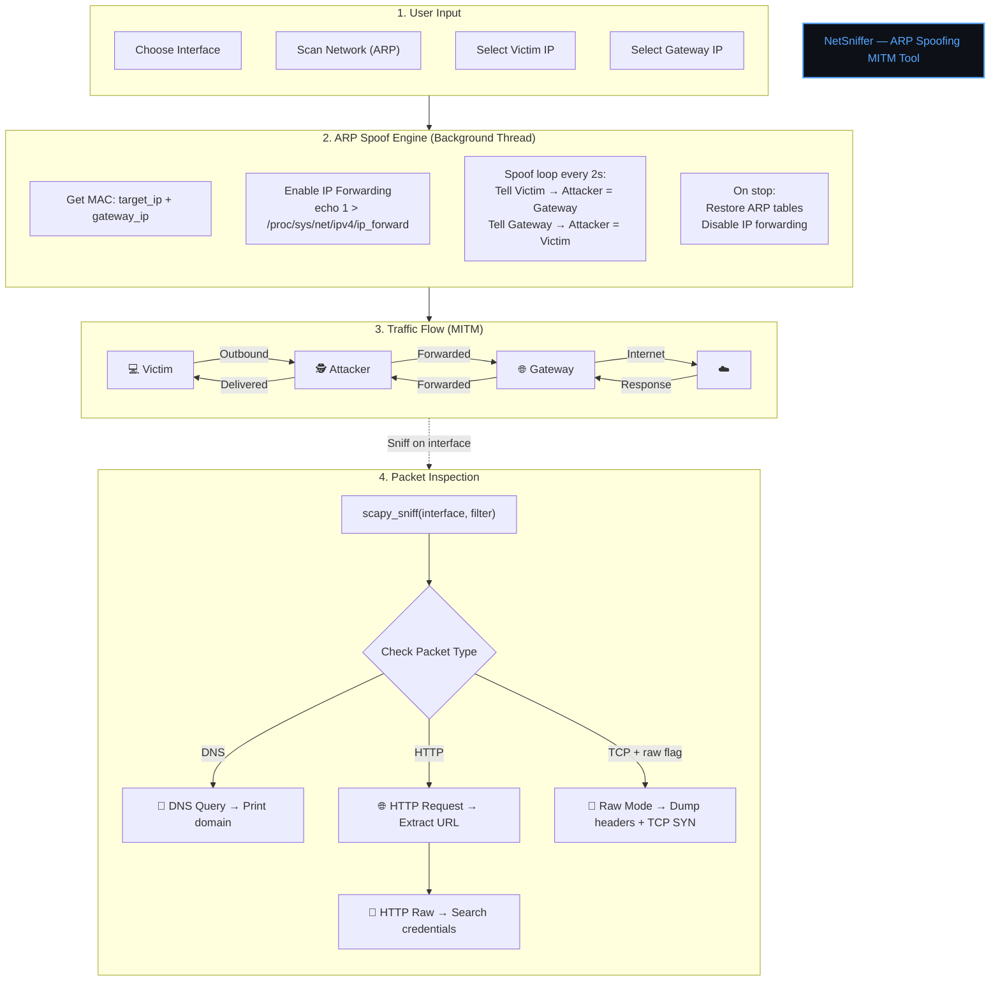

<div align="center">

# 🔭 NetworkSniffer

**A Python-based HTTP packet sniffer that captures and inspects live network traffic in real time.**


> ⚠️ **For educational and authorized testing purposes only.** Do not use on networks you do not own or have explicit permission to monitor.

</div>

---

## 📖 Overview

NetworkSniffer passively listens on a chosen network interface and surfaces HTTP traffic in a human-readable format. It detects visited URLs, extracts potential login credentials from plaintext POST requests, and can optionally dump raw HTTP headers — all from a clean, color-coded terminal UI.

It is designed to be used **after running an ARP Spoofer** so that the machine becomes a man-in-the-middle and can see traffic from other hosts on the LAN. The ARP spoof flow now stays in the background, so the sniffer can be launched immediately after spoofing starts.

---

## 🏗️ Architecture



---

## ✨ Features

| Feature                     | Description                                                                |
| --------------------------- | -------------------------------------------------------------------------- |
| 🌐 **Live HTTP Sniffing**   | Captures all HTTP traffic on a chosen interface in real time               |
| 🔑 **Credential Detection** | Scans POST body for keywords like `username`, `password`, `email`, `login` |
| 🗺️ **URL Extraction**       | Prints source IP, HTTP method, host and request path for every request     |
| 📋 **Raw Packet Dump**      | Optional full HTTP header dump for deep inspection                         |
| 🖥️ **Interface Table**      | Auto-detects and displays all network interfaces with MAC and IP           |
| 🎨 **Color-coded Output**   | Uses Colorama for clear, readable terminal output                          |
| 🔁 **Cross-platform**       | Works on Linux, macOS, and Windows (with Npcap)                            |
| 🔍 **Built-in Live Scan**   | Starts a real-time ARP-based network device scanner when ARP spoofing runs |

---

## 🔧 Prerequisites

### Python Packages

Install all Python dependencies with:

```bash
pip install -r requirements.txt
```

### 🪟 Windows — Npcap (Required)

Scapy needs a packet-capture driver on Windows. **Npcap** is the modern, supported option:

1. Download the installer from **[npcap.com](https://npcap.com/#download)**
2. Run the installer
3. ✅ Check **"WinPcap API-compatible Mode"** during setup
4. Reboot if prompted

> Linux and macOS users have `libpcap` built in — no extra driver needed.

### 🐧 Linux — Root Privileges

Raw packet capture requires root on Linux:

```bash
sudo python main.py
```

---

## 🚀 Installation

```bash
# 1. Clone the repository
git clone https://github.com/<your-username>/NetworkSniffer.git
cd NetworkSniffer

# 2. (Recommended) Create a virtual environment
python -m venv .venv

# On Linux/macOS
source .venv/bin/activate

# On Windows
.venv\Scripts\activate

# 3. Install dependencies
pip install -r requirements.txt
```

---

## ▶️ Usage

> **Important:** Run an ARP Spoofer first to redirect LAN traffic through your machine, otherwise you will only see your own traffic.

```bash
# Linux / macOS
sudo python main.py

# Windows (run terminal as Administrator)
python main.py
```

### Interactive Prompts

```
Welcome To Packet Sniffer
[***] Please Start ARP Spoofer Before Using this Module [***]

[*] ARP spoofing is running in the background. Start packet sniffer now? (Y/N): Y

[*] Do you want to print the raw Packet? (Y/N): Y

+------------+-------------------+---------------+
| Interface  |    Mac Address    |   IP Address  |
+------------+-------------------+---------------+
| eth0       | aa:bb:cc:dd:ee:ff | 192.168.1.5   |
| lo         | 00:00:00:00:00:00 | 127.0.0.1     |
+------------+-------------------+---------------+

[*] Please enter the interface name: eth0
[*] Sniffing Packets...

[+] HTTP REQUEST >>>>>
192.168.1.10 just requested
 GET  example.com  /login

[+] Username OR password is sent >>>>  username=admin&password=hunter2
```

Press **`Ctrl + C`** at any time to stop sniffing.

---

## 📁 Project Structure

```
NetworkSniffer/
│
├── main.py              # Core sniffer logic
├── requirements.txt     # Python dependencies + Npcap note
└── README.md            # This file
```

---

## 🧩 How It Works

```
1. Startup
   └─ User selects interface from auto-detected list (via psutil)

2. Sniffing Loop  [scapy_sniff]
   └─ Every packet is passed to process_sniffed_packet()

3. HTTP Filter
   └─ Packets without an HTTPRequest layer are discarded

4. For matching packets:
   ├─ url_extractor()    → prints Source IP + Method + Host + Path
   ├─ get_login_info()   → scans raw payload for credential keywords
   └─ raw_http_request() → (optional) dumps all HTTP header fields
```

> **Why HTTP only?** HTTPS traffic is encrypted end-to-end — only plaintext HTTP traffic can be inspected by this tool.

---

## 🖥️ Platform Support

| Platform   | Capture Driver             | Privilege            | Status             |
| ---------- | -------------------------- | -------------------- | ------------------ |
| 🐧 Linux   | libpcap (built-in)         | `sudo` required      | ✅ Fully supported |
| 🍎 macOS   | libpcap (built-in)         | `sudo` required      | ✅ Fully supported |
| 🪟 Windows | Npcap (install separately) | Run as Administrator | ✅ Supported       |

---

## ⚖️ Legal & Ethical Disclaimer

> This tool is intended **strictly for educational purposes** and authorized penetration testing on networks you own or have written permission to test.
>
> Unauthorized interception of network traffic is **illegal** in most jurisdictions under laws such as the Computer Fraud and Abuse Act (CFAA), the UK Computer Misuse Act, and equivalents worldwide.
>
> The author accepts **no responsibility** for misuse of this software.

---

## 🤝 Contributing

1. Fork the repository
2. Create a feature branch: `git checkout -b feature/my-feature`
3. Commit your changes: `git commit -m 'Add my feature'`
4. Push to the branch: `git push origin feature/my-feature`
5. Open a Pull Request

---

## 📄 License

This project is licensed under the **MIT License** — see the [LICENSE](LICENSE) file for details.

---

<div align="center">

Made with ❤️ for learning network security fundamentals.

</div>
